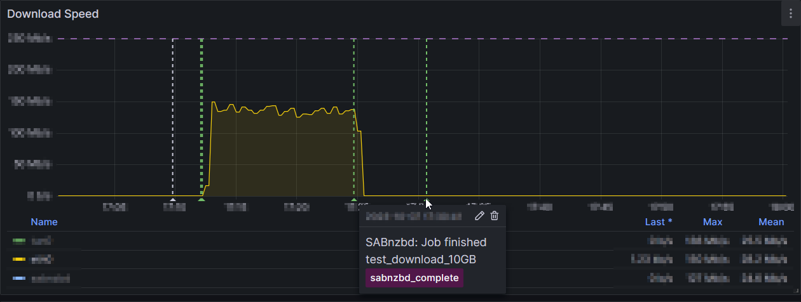

# SABnzbd Notify Script for Grafana

This script can be used with SABnzbd to create Grafana annotation for notifications.

## Installation

1. Create a Service Account in Grafana and note down the API token.
2. Put `notify-grafana.py` in the scripts folder of your SABnzbd installation.
3. Select this script as notify script.
4. Provide the following arguments as script parameters:

```shell
# Required parameters
-u <base url of grafana
-t <service account token for grafana>
-d <uid of target dashboard>

# Example:
-u https://grafana.example -t glsa-secure-token -d wikrj3jk5lk
```

5. Send a test notification to see if everything is working

## Example



## More 

- [SABnzbd docs for notify scripts](https://sabnzbd.org/wiki/configuration/4.1/scripts/notification-scripts)